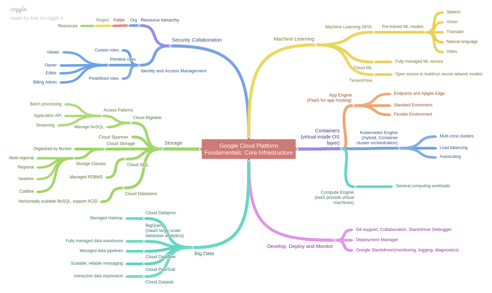

The following is the mind map I created after taking the Google onsite training course of GCP fundamentals: Core Infrastructure. This help me to review and organize what I learnt from GCP course. You can find this course on both [Google Cloud Training](https://cloud.google.com/training/courses/core-fundamentals) and [Coursera](https://www.coursera.org/learn/gcp-fundamentals) if you feel interested to learn more. 

